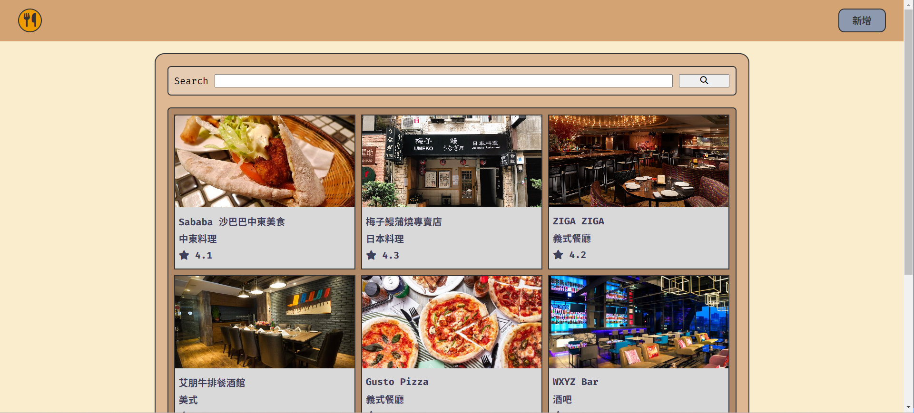

# 我的餐廳清單



## 介紹

紀錄屬於自己的餐廳清單，可以瀏覽餐廳、查看詳細資訊、甚至連結到地圖。

### 功能

- 查看所有餐廳
- 瀏覽餐廳的詳細資訊
- 連結餐廳的地址到 Google 地圖
- 搜尋特定餐廳
- 新增餐廳資訊 (NEW)
- 編輯餐廳資訊 (NEW)
- 刪除餐廳資訊 (NEW)

## 開始使用

1. 請先確認有安裝 node.js, npm, mysql
2. 將專案 clone 到本地
3. 在本地開啟之後，透過終端機進入資料夾，輸入：

   ```bash
   npm install
   ```

4. 安裝完畢後，請依序輸入：

   #註解#

   #預設MySQL參數為：user=root / host=127.0.0.1 / password=password (修改請見config.json)

   #預設database名稱：rest / table名稱：rests (修改請見app.js)

   #刪除database可執行：```npm run db:drop```

   ```bash
   npm run db:create
   npm run db:migrate
   npm run db:seed
   npm run start
   ```

5. 若看見此行訊息則代表順利運行，打開瀏覽器進入到以下網址

   ```bash
   http://localhost:3000
   ```

6. 若欲暫停使用

   ```bash
   ctrl + c
   ```

## 開發工具

- Node.js 20.11.0
- Mysql2: 3.9.2
- Font-Awesome 6.5.1